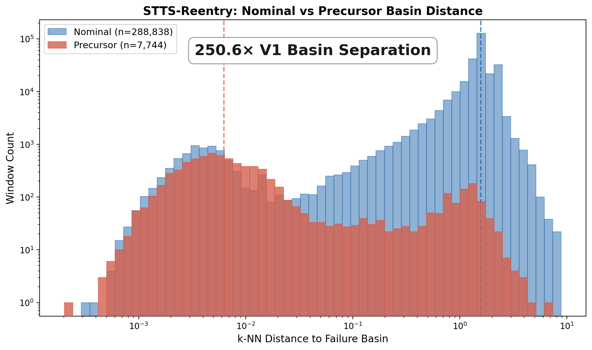
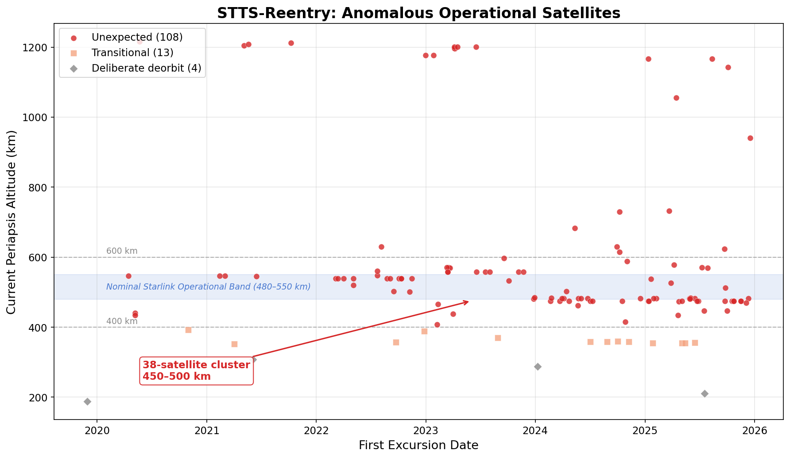
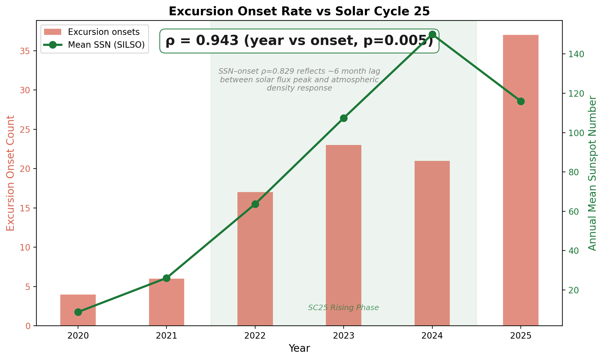
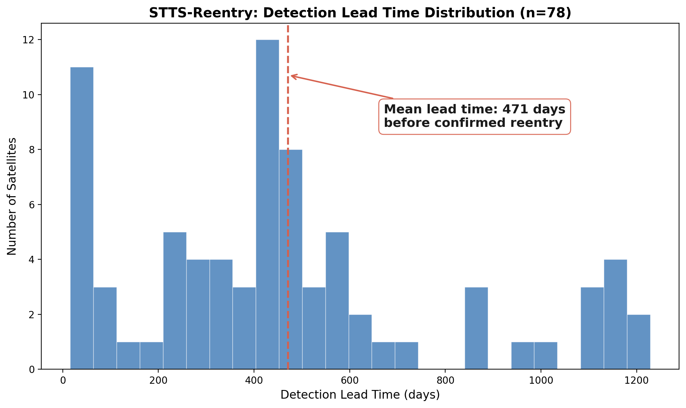

# STTS-Reentry Results — Data Notes

## Anomalous Satellite Output Flags

`firing_satellites_125.csv` contains 125 operational satellites showing
sustained reentry-like orbital signatures. Two entries have apoapsis
values inconsistent with near-circular LEO orbits and should be treated
with caution:

| NORAD ID | Periapsis (km) | Apoapsis (km) | Note |
|----------|----------------|---------------|------|
| 47307    | 352.5          | 47,370.0      | Highly elliptical orbit (GTO-like) or data artifact |
| 44480    | 187.5          | 18,947.1      | Highly elliptical orbit (MEO-class) or data artifact |

These apoapsis values (47,370 km and 18,947 km) are inconsistent with
Starlink operational orbits (~550 km circular). Possible explanations:

1. **TLE fitting artifact** — Space-Track's GP element set occasionally
   produces spurious eccentricity for objects with limited tracking data.
2. **Non-Starlink object** — international designators may include
   upper stages or deployment hardware cataloged under the same launch.
3. **Genuine HEO/GTO orbit** — object may have failed to circularize
   after launch.

These two entries do not affect the 108 "unexpected" satellite count
(both are in the deliberate deorbit or transitional categories based
on periapsis), but their inclusion in the 125-satellite output warrants
flagging for downstream consumers.

## Visualizations for CARA Discussion

Log-scale histogram showing 250.6x median distance separation between nominal and precursor trajectory windows.

Scatter of 125 operationally flagged satellites by first excursion date and current periapsis altitude, colored by category.

Dual-axis plot of excursion onset count versus annual mean sunspot number, showing strong correlation with Solar Cycle 25.

Histogram of detection lead times across 78 confirmed reentry events, with mean lead time annotated.

Generated by `plots/generate_plots.py` — run after any data changes.
